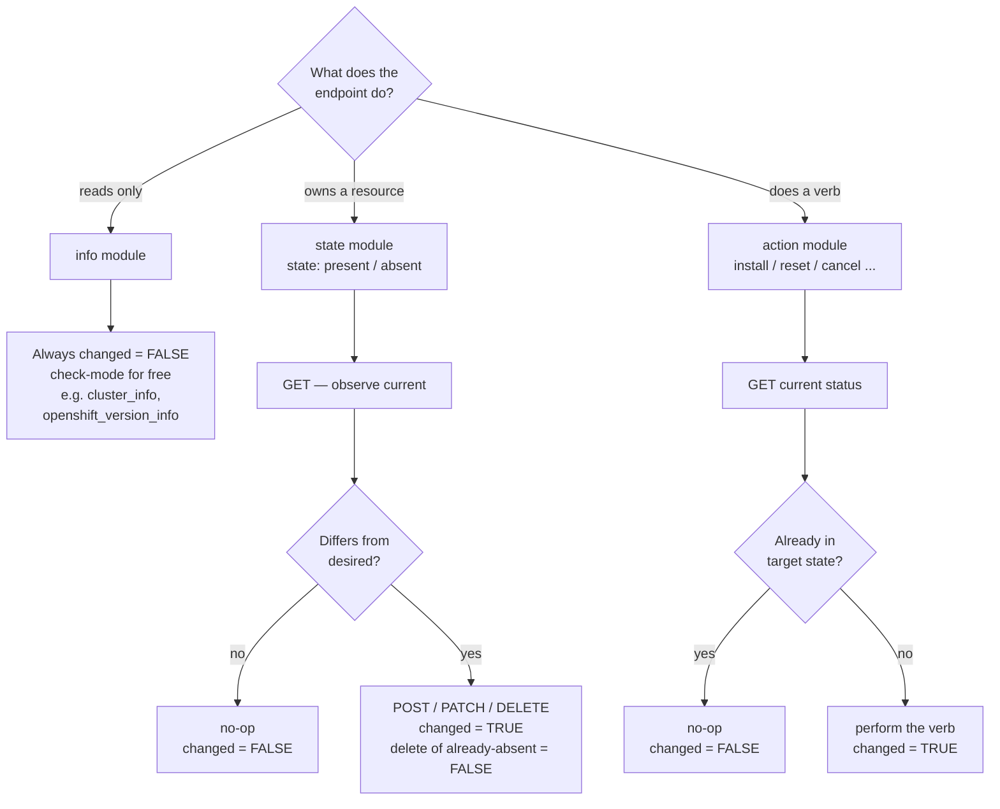

# DESIGN.md — cld_ai

Design notes for the `openshift_lab.assisted_installer` collection. This captures
the decisions made *before* implementation so the coding sessions stay consistent.
Code-level conventions live in [CLAUDE.md](CLAUDE.md).

## 1. How to read the decisions: three kinds of consideration

| Kind | Question it answers | Where it lives | Examples |
|------|--------------------|----------------|----------|
| **Design** | *What* is it / how does it behave? | this file + CLAUDE.md | namespace/FQCN, scope & phasing, per-resource idempotency, module interface, check-mode |
| **Implementation** | *How* is it coded? | CLAUDE.md | `fetch_url` client, shared `module_utils`, timeouts, fail-fast auth, error handling |
| **Project / governance** | How is it governed? | config files | license, ansible-core support matrix, testing posture, CI, repo hygiene |

The design/implementation line is intentionally fuzzy (e.g. "shared `module_utils`
client" is architectural but realized in code) — the table is a guide, not a law.

## 2. Identity

- **FQCN:** `openshift_lab.assisted_installer`.
- **Why `openshift_lab`, not `openshift`:** `openshift` is a claimed/reserved
  Galaxy namespace (Red Hat ships `redhat.openshift`); using it can't be published
  and misleadingly implies an official collection. `openshift_lab` is clearly a
  personal/lab namespace and is legal (lowercase, letters/digits/underscores).

## 3. Scope & phasing

The **API** is `v2` (the `/v2/` path). These phases are *collection release
milestones*, not API versions.

### Phase 1 (`1.0.0`) — solid, tested, idempotent foundation
- Read-only info modules: `openshift_version_info`, `support_level_info`,
  `supported_operator_info`
- Declarative CRUD done properly: `cluster`, `infra_env`
  (idempotent create/update/delete via GET → PATCH), each paired with a
  read-only `cluster_info` / `infra_env_info`

### Phase 2 (`2.0.0`+) — the install lifecycle
- Host management: `host` / `host_info` (register/update/deregister) plus
  `host_action` (bind, unbind, install, reset)
- Cluster actions: `cluster_action` (install, reset, cancel,
  complete-installation, allow-add-hosts, allow-add-workers)
- Download/info helpers: ISO URL, credentials / kubeconfig

Ship Phase 1 correct and green before starting Phase 2.

## 4. Per-resource idempotency model

Idempotency is **not** one recipe applied uniformly. Classify each endpoint:

| Pattern | Resources | Behavior |
|---------|-----------|----------|
| **Read-only / info** | `openshift_version_info`, `support_level_info`, `supported_operator_info`, `event_info` | Never changes state → always `changed=False`. `supports_check_mode=True` for free. |
| **State-based (declarative)** | `cluster`, `infra_env` | `state: present/absent`. GET by name/id → observe; create if missing; PATCH if drifted; delete if present. `changed` = real change. Delete of already-absent = `changed=False`. |
| **RPC-style actions** | `cluster_action`, `host_action` (Phase 2) | Verbs, not desired state — cannot "PATCH to converge." Idempotency = check current status *first* and no-op if already in the target state. |

The Assisted Installer API is designed for the state-based pattern: it exposes
`GET` (list + by-id) and `PATCH` for both `clusters` and `infra-envs`, so
observe→compare→act maps directly onto real endpoints.

The same promise — a re-run reports `changed=False` when nothing really changed —
is reached three different ways depending on the classification:



## 5. Module naming convention

Names follow Ansible's **published** module conventions so the collection is
Galaxy / Automation-Hub publishable and reads the way Ansible users expect.

- **Managed resources use the singular** (`cluster`, `infra_env`, `host`),
  driven by `state: present/absent`. `cluster: {state: present}` reads correctly;
  a plural `clusters` managing one resource does not.
- **Read-only modules end in `_info` and are singular** — required by the module
  dev guide (info modules MUST be named `<something>_info`, singular, returning
  via the normal result dict, not `ansible_facts`). This covers both queries on
  managed resources (`cluster_info`, `infra_env_info`, `host_info`) and catalog
  lookups (`openshift_version_info`, `support_level_info`,
  `supported_operator_info`, `component_version_info`, `operator_bundle_info`,
  `release_source_info`, `managed_domain_info`, `event_info`). An `_info` module
  that returns a *list* is idiomatic (cf. `kubernetes.core.k8s_info`).
- **RPC-style actions are grouped per resource** into one `*_action` module with
  an `action:` choices param (`cluster_action`, `host_action`) rather than one
  module per verb — the "guard on current status" logic lives in one place and
  the valid verbs self-document via `choices`. Precedent: `ansible.builtin.service`
  folds the imperative `restarted` / `reloaded` into a single module.

### Parameter naming convention

**Resource identifier parameters use explicit forms** (`cluster_id`, `infra_env_id`,
`host_id`) not short forms (`id`).

**Rationale:**
- **100% consistent** across ALL modules — single-resource and multi-resource
- Already established in `host_action` (implemented with `host_id` + `infra_env_id`)
- Matches API path parameters exactly (`/v2/clusters/{cluster_id}`)
- No ambiguity when modules reference multiple resources (e.g., `cluster_manifest`
  needs both `cluster_id` and `manifest_id`)
- Future-proof: adding a second resource doesn't force parameter renaming
- Self-documenting in playbooks

**Pattern:**
```python
# cluster_info module
cluster_id=dict(type="str")    # Explicit, matches API path parameter

# infra_env module  
infra_env_id=dict(type="str")  # For updates
cluster_id=dict(type="str")    # Optional association

# host_action module (already implemented)
host_id=dict(type="str", required=True)
infra_env_id=dict(type="str", required=True)
```

**Multi-resource consistency:**
When a module operates on hosts within infra-envs (like `host_action`), both
identifiers are explicit (`host_id`, `infra_env_id`) — never mixing short and
explicit forms in the same module.

**Precedent:** amazon.aws uses `instance_ids` (explicit); our `host_action` uses
explicit forms (proven pattern in this collection).

**Trade-off accepted:** Slightly more verbose than short forms (`id`), but consistency
and clarity across 71 modules outweighs brevity.

References: Ansible module dev guide (`developing_modules_general`,
`developing_modules_best_practices`); real-world examples that follow this scheme —
amazon.aws (`ec2_instance` + `ec2_instance_info`), kubernetes.core (`k8s` +
`k8s_info`), redhat.openshift / community.okd (all singular).

## 6. Module granularity principle

How to decide when to split functionality into multiple modules vs. consolidating
into one flexible module.

**Industry precedent** (kubernetes.core, amazon.aws, azure.azcollection,
community.docker): Collections consolidate related operations into fewer, more
flexible modules rather than proliferating specialized modules.

### Split criterion — Create separate modules when:

1. ✅ **Resource has independent lifecycle** (can exist without parent)
   - Example: `host_info` separate from `cluster_info` (hosts exist independently)
   - Example: `cluster_manifest` + `cluster_manifest_info` separate (manifests have CRUD lifecycle)
2. ✅ **Different authentication/permission scope**
3. ✅ **Fundamentally different operation pattern** (e.g., download vs. query)

### Consolidate criterion — Use ONE module with parameters when:

1. ✅ **Sub-data is part of the resource** (no independent existence)
   - Example: cluster credentials are derived from cluster state (no lifecycle)
   - Example: cluster install-config is cluster metadata (no independent existence)
2. ✅ **Same API client/authentication**
3. ✅ **Just different fields/projections** of the same resource

### Examples from this collection

**Consolidation (follow these patterns):**
- ✅ `supported_operator_info`: Consolidates list + get-by-name (2 endpoints, 1 module)
- ✅ `host_action`: Consolidates bind/unbind/install/reset (4 endpoints, 1 module with `action` param)
- ✅ `cluster_info`: Consolidates core metadata + credentials + config + default-config (10+ endpoints, 1 module with optional params)

**Separation (independent lifecycles):**
- ✅ `cluster_manifest_info` + `cluster_manifest`: Separate (manifests have independent CRUD lifecycle)
- ✅ `host_info` + `host`: Separate (hosts exist independently of clusters)
- ✅ `infra_env_info` + `infra_env`: Separate (infra-envs have independent lifecycle)

### Anti-patterns to avoid

- ❌ Splitting by endpoint URL structure alone
- ❌ `cluster_info` + `cluster_credentials_info` + `cluster_config_info` + `cluster_logs_info` + ...
  (no industry precedent; increases user/maintainer burden)
- ❌ One module per HTTP verb (`cluster_create`, `cluster_update`, `cluster_delete` — use `state:` instead)

**When uncertain:** Default to consolidation. Parameters are cheaper than modules.

**Precedent citations:**
- **kubernetes.core:** `k8s_info` queries ANY resource type via `kind` parameter (pods, services, deployments) — not separate `k8s_pod_info`, `k8s_service_info`
- **amazon.aws:** `ec2_instance_info` returns all instance data; `aws_caller_info` returns identity + credentials — not split by sub-resource
- **azure.azcollection:** `azure_rm_virtualmachine_info` returns all VM data — not split into network/storage/tags modules
- **community.docker:** `docker_container_info` returns container data including network/volume mounts — those are part of container state, not separate modules

## 7. Key decisions locked in

- **HTTP client:** `fetch_url` (dependency-free, sanity-clean, EE-friendly).
- **License:** GPL-3.0-or-later — GPLv3 headers on module files (the Ansible norm;
  keeps `validate-modules` green without ignore entries).
- **Secrets:** module params with `no_log=True` (and/or env), documented
  consistently; never committed.
- **ansible-core matrix:** `requires_ansible >= 2.17`; CI tests stable-2.17,
  stable-2.18, and stable-2.19; sanity ignore files exist per supported version
  and stay in sync.
- **Testing:** units always (API mocked); integration selectively — the
  unit/integration mix is defined in [§8](#8-testing-strategy--unit-vs-integration).
  No live calls or credentials in CI, ever. Coverage ≥90% enforced (execution-based
  gate that complements pattern-based review).

## 8. Testing strategy — unit vs. integration

**Principle: units prove the *logic*; integration proves the *wiring and the
multi-step lifecycle*.** Both mock the network — the API is never called for real.

### Units — every module, always
Patch `fetch_url` so the real shared client runs (URL building, query encoding,
JSON parsing, status handling) but no HTTP leaves the process. Required cases:

- happy path + **idempotency** (2nd identical run → `changed=False`)
- **check mode** (never mutates; correct `changed`)
- **fail-fast on missing token** (asserts *zero* HTTP calls attempted)
- non-2xx → `fail_json` with status
- for state/action modules: the create/act path sets `changed=True`

Units **own** URL/auth/query-encoding/error-mapping/param-validation — these are
fast and exhaustive here and must **not** be duplicated in integration.

**Coverage ≥90% enforced:** `ansible-test units --coverage` tracks statement and
**branch** coverage. The report shows missing lines and partially-covered branches
(e.g., a check-mode `if` that never fires in tests). Branch coverage catches
untested conditional paths that line coverage alone would miss. Both local
(`./run.sh --check`) and CI enforce the 90% threshold; CI posts a detailed report
to every PR.

### Integration — selective, and only against a local mock
Add `tests/integration/targets/<module>/` **only where it earns its keep**:

| Module kind | Integration? | Why |
|-------------|:------------:|-----|
| **info** (`*_info`) | ❌ | units cover the full contract; integration is redundant |
| **state** (`cluster`, `infra_env`) | ✅ | prove `present → present(no-op) → absent → absent(no-op)` across real playbook runs |
| **action** (`cluster_action`, `host_action`) | ✅ | prove guard-on-status across sequenced calls / status transitions |
| **download** helpers | ⚠️ optional | a smoke target at most |

**Hard rule:** integration NEVER targets `api.openshift.com`. Modules expose a
`base_url` override; integration points it at a **local mock HTTP server** fixture
returning canned responses, gated so it cannot reach prod. No credentials, no
network egress.

### Test-Driven Development (TDD) workflow

For quality-critical modules, **generate and approve tests FIRST** before writing
the module. Tests become the executable specification rather than post-hoc validation.

**TDD approach:**
1. Verify API contract (query OpenAPI spec, document findings)
2. Generate tests based on spec (all applicable categories per module type)
3. **Human approves tests** (verify tests match spec, not agent interpretation)
4. Generate module to satisfy approved tests
5. Run gates (should pass immediately)

**Note:** All module types use the same 5 categories (lifecycle, idempotency, check-mode,
safety guards, API contract); what varies is the specific tests within each category.
See §8 "Units — every module, always" for the required cases per module type.

**Quality improvement:**
- Builder-validator chains show +15.6% improvement in research
- Addresses "gray errors" (research: 75.17% of failures pass tests but have wrong logic)
- Tests define WHAT to build; module generation satisfies HOW
- Faster iteration (fix module to pass stable tests)

**When to use:**
- State modules (lifecycle complexity)
- Complex modules (many edge cases, query parameters)
- First module of a new pattern

See issue #32 for full TDD adoption rationale.

### When to build the integration layer
Not yet. Phase 1's info modules need units only. Introduce the `base_url` param,
the mock-server fixture, the `tests/integration/` targets, and the CI
`Integration` job **together with the first state-based module** (`cluster` /
`infra_env`) — that PR is the trigger. Sanity already validates doc/argspec
consistency at runtime, so that layer is covered independently.
