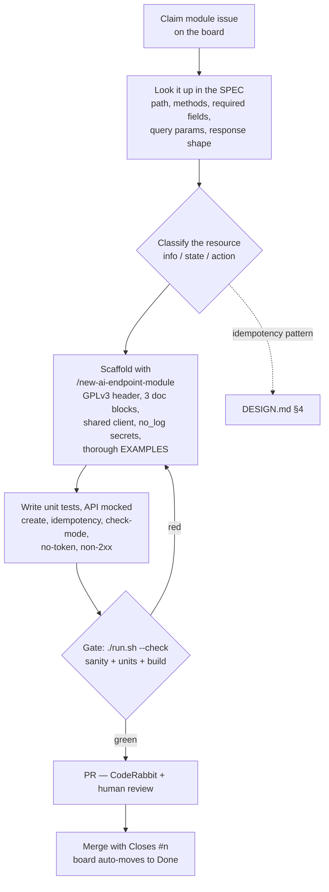

# Agentic SDLC

A short, shareable explainer for anyone contributing to this repo. Read it once
to get the mental model; the last section maps it to how `cld_ai` actually works.

## What it is, in one sentence

**Agentic SDLC is running the normal software lifecycle — plan, build, test,
review, ship — with AI agents doing the execution while humans move "up the
stack" to defining intent and approving at gates.** The phases don't change. What
changes is the question you're answering: not *"how do I write this?"* but *"how
do I specify this and verify it clearly enough that an agent can build it and I
can trust the result?"*

## The mental model: author → editor-in-chief

- In **traditional development** you're the *author*. You type every line, and
  quality comes from your care as you write.
- In **agentic development** you're the *editor-in-chief*. You commission work,
  set the standards, and decide what ships. Quality comes from **how good your
  standards are and how well you can check the work** — because you didn't write
  it, and the agent is fast, tireless, and confidently wrong sometimes.

That last part is the whole point. An agent produces something *plausible*.
Plausible is not the same as correct. So the entire discipline is about **making
"correct" checkable without re-reading every line.**

## The three pillars

Agentic SDLC is not "let the AI do it." It rests on three things; if any is
missing it degrades into plausible-looking slop.

1. **A source of truth the agent can read.** An authoritative reference so the
   agent looks things up instead of guessing — ideally machine-readable, not
   tribal knowledge in someone's head.
2. **Rules that encode "done right."** Conventions, constraints, and patterns
   written down explicitly. This is what lets you split work across many agents
   in parallel *without* each one re-inventing the architecture.
3. **Gates that pass or fail on their own.** Automated checks that render an
   objective verdict no human has to — tests, linters, CI, a build. This is the
   defense against "plausible but wrong."

A one-liner worth remembering:

> **The agent writes the code; the gates decide if it's real; the human decides
> if it's right.**

Those are three different jobs.

## The loop, phase by phase

| Phase      | Traditional                     | Agentic                                                  |
| ---------- | ------------------------------- | ------------------------------------------------------- |
| **Plan**   | Human decides, holds it in head | Human decides and *writes it down* so agents can apply it |
| **Build**  | Human types code                | Agent drafts code from the spec + rules                 |
| **Test**   | Human writes tests after        | Tests are the *contract* — often agent-generated, always the objective gate |
| **Review** | Human reads everything          | Automated review first pass, human at the final gate    |
| **Ship**   | Human releases                  | Agent preps, human approves                             |

What *doesn't* change: the phases, and the fact that a human owns intent and the
final yes. What changes is that **writing things down stops being bureaucracy and
becomes the interface** — the docs aren't overhead, they're how you program the
agents.

## Two mindset shifts that trip people up

1. **Specifying clearly is now the skill.** A vague request yields
   plausible-but-wrong output, fast. Value moves from typing speed to precision
   of intent and quality of your acceptance criteria.
2. **Trust is earned by verification, not by reading.** You will merge code you
   didn't write and didn't read line-by-line. That is only safe because the gates
   are real — so part of the job is *strengthening the gates*, not just passing
   them. A weak gate is a liability the moment an agent is behind it.

## Where humans must stay in the loop

"Agentic" does not mean "automatic." Humans own:

- **Judgment calls and ambiguity** — when the spec is unclear or a design choice
  has real trade-offs.
- **Anything hard to reverse or security-sensitive** — auth, secrets, releases,
  branch protection.
- **The gaps the gates can't check** — e.g. "are these examples actually
  *thorough* and useful?" A linter checks that they *parse*; only a human checks
  that they *teach*. Knowing which is which is the core literacy.

## The honest failure mode

Agentic SDLC fails when it produces **volume that looks done but isn't.** Ten
green PRs that each quietly misread the spec are worse than one hand-written
module, because it *feels* like progress. The guardrails — spec, rules,
executable gates, and a human at the final gate — exist precisely to catch that.
They are not red tape; they are what makes the speed safe.

## How this maps to `cld_ai`

This repo is deliberately built as a substrate for the three pillars:

- **Source of truth:** the OpenShift Assisted Installer OpenAPI spec, plus
  [`docs/api-endpoint-map.md`](api-endpoint-map.md) — all 81 endpoints classified
  by idempotency pattern. An agent looks up an endpoint's pattern instead of
  guessing it.
- **Rules:** [`CLAUDE.md`](../CLAUDE.md) (loaded automatically by Claude Code) and
  [`DESIGN.md`](../DESIGN.md) — naming, per-resource idempotency, check-mode,
  `no_log` secrets, GPLv3 headers, and the required doc blocks. These are the
  agent's definition of done.
- **Gates:** `ansible-test sanity` + `ansible-test units` (API mocked at
  `fetch_url`), `yamllint`/`ansible-lint`, and `./run.sh --check`. `main` is
  protected: passing CI **and** one human review are required to merge.

The workflow a contributor (human or agent-assisted) follows:

1. **Claim intent** — assign yourself a module issue on the board (one module per
   issue), or open one from the endpoint map. See
   [`CONTRIBUTING.md`](../CONTRIBUTING.md).
2. **Generate against the rules** — scaffold with `/new-ai-endpoint-module`, which
   already knows this API's base URL, auth, and shared `fetch_url` client, and
   picks the idempotency skeleton from the resource's classification.
3. **Let the gates run** — units (required cases in DESIGN.md §7), sanity, and
   lint must be green before the PR.
4. **Verify what the gates can't** — read the diff, check it against the spec, and
   confirm `EXAMPLES` are thorough for the module's kind, not a stub. **You own
   correctness** — generated code is a starting point, not a merge-ready artifact.
5. **Merge at the gate** — CodeRabbit reviews automatically (advisory); a human
   approves. Link the PR with `Closes #<n>` so the board moves it to Done.

Visually, that loop looks like this — *think* (steps 1–2), *classify* (the one
decision that drives the rest, detailed in [DESIGN.md §4](../DESIGN.md#4-per-resource-idempotency-model)),
*build* (3–4), then *machine-verify* at the gate and *human-verify* at review:

The through-line: because the plan and rules are *written down* and the gates are
*executable*, the work can be decomposed and run in parallel while a human stays
at the intent and the final yes — which is exactly what agentic SDLC is.
